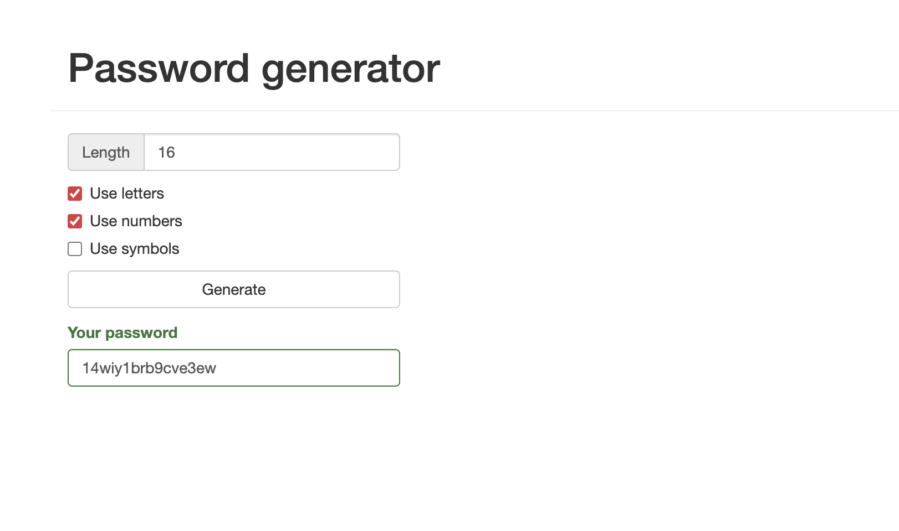

# Password Generator

## Description

Generate a random password with a specified length and the option to include letters, numbers and symbols.

## Demo

View project live: https://1-password-generator.vercel.app

## Screenshot

## Technologies used

This project was created using [Angular](https://github.com/angular/angular-cli) version 14.2.4.

Other technologies used: 

 - HTML
 - CSS
 - TypeScript
 - Bootstrap CSS
 - Vercel

## Acknowledgments
* [Angular course](https://www.udemy.com/course/the-modern-angular-bootcamp/)